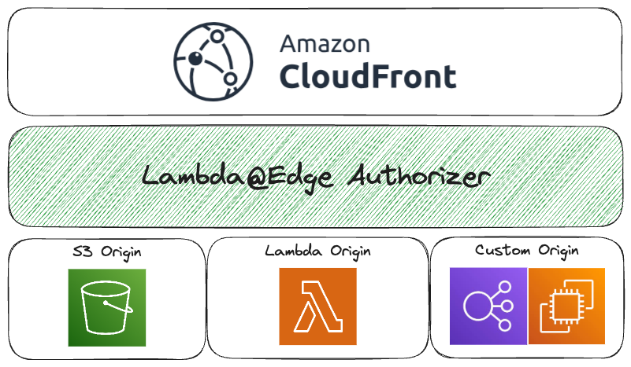

# Lambda@Edge Authorizers

A monorepo for [the Lambda@Edge Authorizer library](./packages/lambda-edge-authorizers/), designed to be dropped into your Lambda@Edge functions.

| Package |
| ---- |
| [`lambda-edge-authorizers`](./packages/lambda-edge-authorizers/) |
| [`lambda-example-auth0`](./packages/lambda-example-auth0/) |
| [`lambda-private-site`](./packages/lambda-private-site/) |

## Known caveats with Lambda@Edge

There are known restrictions on [all edge functions](https://docs.aws.amazon.com/AmazonCloudFront/latest/DeveloperGuide/edge-function-restrictions-all.html) & [Lambda@Edge functions](https://docs.aws.amazon.com/AmazonCloudFront/latest/DeveloperGuide/lambda-at-edge-function-restrictions.html), details include:

**Environment variables cannot be set on Lambda@Edge functions.**

- Default env vars bundled into the Lambda runtime are still present.
- Therefore, you should [bundle your Lambda functions](./cdk/lambda-authorizer.ts#L34) with secrets baked in, and restrict access to those functions as appropriate.

**When removing Lambda@Edge functions:**

- You must remove the function from all Cloudfront distributions.
- Wait a few hours for the edge replicas to be automatically deleted.
- Then delete your Lambda function.
- Therefore, `RETAIN` all functions in IaC code & manually clean them up post-deployment.

## Examples

This repository has a small collection of example packages for inspiration, prefixed with `lambda-example-*`.

- These packages, although deployed to Lambda@Edge, are built with `aws-cdk` to ensure their "environment variables" are [bundled](./cdk/lambda-authorizer.ts#L34) correctly.
- Review their `.env.example` for more details.
